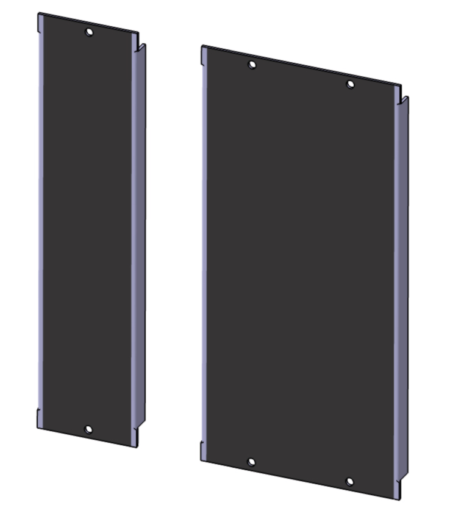

# 5U-modular-panels

Contained is a ZIP of 3D CAD files in STEP format (readable by any Engineering CAD program) for blank 5U modular synthesizer panels.
The penals are in the Moog Unit format, and are the type of panel used it Dotcom, original 5U Moog, and others.  
Sizes modeld are 1MU through 10MU width.

CC-BY-SA-4.0

Example image of the STEP models of the 1MU and 2MU panels:

